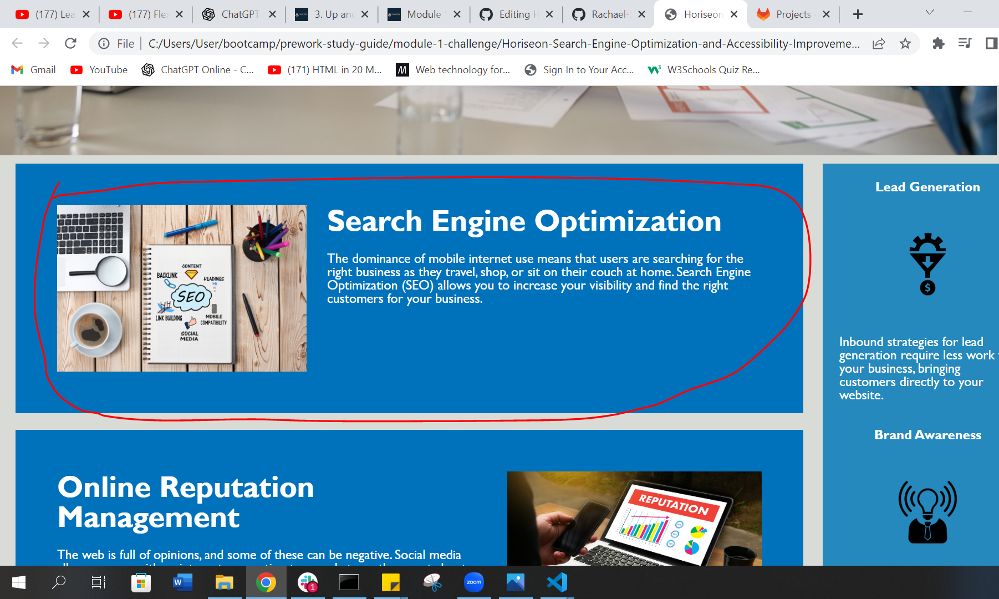

# Horiseon Search Engine Optimisation and Accessibility Improvements for client website
# Module 1 challenge HTML, CSS and Git refractorting 

This project was designed to show off our skills learned in week one of our bootcamp. The main task described as an on the job ticket to refractor
an exsisting code for an online Marketing Agency website.
My project aims to benifit users by increasing search engine optimisation and improve accessability/functionality with the following additions

* Can be found though search engines with addition of new "title" in the head section
* Webpage name is featured in the tab/toolbar in browsers
* ability utlize the bookmark feature
* Enhanced accessibility features for SEO by using "veiwport","name" & "description" links in the head tag 
* Use of alt text for images making it more accessable for those with screen readers
* cleaner CSS and HTML code templates

## Webpage Hyperlink and File Installation

To veiw webpage right click on the following hyperlink [ClickHere](https://github.com/Rachael-Stead/Horiseon-Search-Engine-Optimization-and-Accessibility-Improvements-for-Client-Website.git) and select  "Open Link in New Browser" or Open in New Tab" depending on your preferences for veiwing.

To Pull the reposity to veiw the code on your PC or Laptop you must have Visual Code installed. Read the following instructions on this [Link](https://code.visualstudio.com/download) to download Visual Studio Code to your desktop or device, if you have not already done so.

**Copy and past the following comands into gitbash:**

*Create a new directory*
```bash
cd [chosen directory]
Mkdir [directory name]
cd [ new directory name]
```
*Pull the code from Github and open to edit/veiw*
```bash
git pull git@github.com:Rachael-Stead/Horiseon-Search-Engine-Optimization-and-Accessibility-Improvements-for-Client-Website.git
cd Horiseon-Search-Engine-Optimization-and-Accessibility-Improvements-for-Client-Website
code .
```
## Usage
The webpage is very simplistic in the way it is designed to be used and navigated, all of the information is accessable on one page by clicking the links displayed
in the header, example below.


By clicking the "search engine optimization" link it takes you to a section of the webpage that is linked to that ID tag.

## Contributing

Pull requests are welcome. For major changes, please open an issue first
to discuss what you would like to change.

## License

[MIT](https://choosealicense.com/licenses/mit/)

## Contact Details
gitHub: https://github.com/Rachael-Stead | Email: Rachael.r.stead@gmail.com | 
